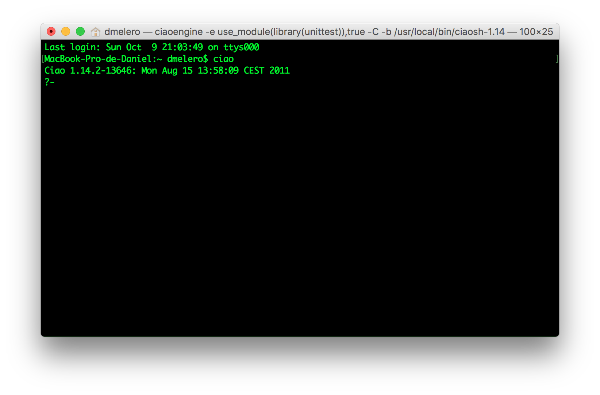
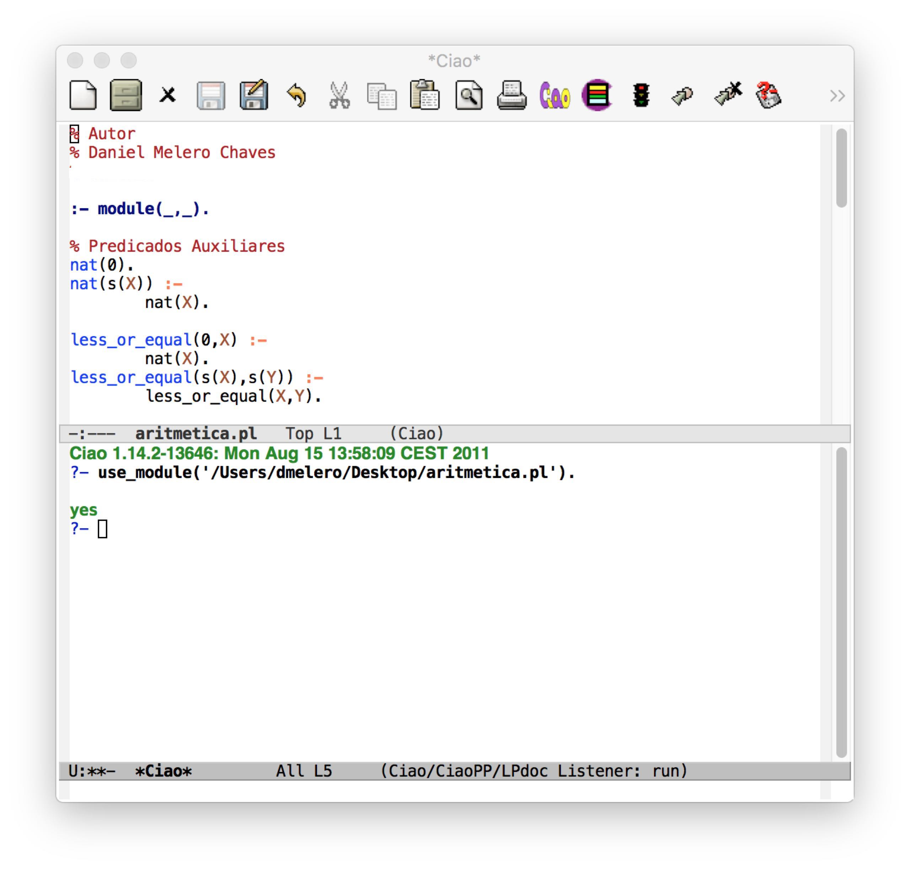

# [EN] Ciao Prolog installation for MacOS

[](README_EN.md)
[](README_ES.md)

**Authors:** [Daniel Melero Chaves] (https://github.com/DanielMChaves) y [Carlos Saito Murata] (https://github.com/exacs)

1. Download emacs app

  Download emacs app for macOS from the official web page: https://emacsformacosx.com

2. Install terminal interpreter

  Download the interpreter from the official web page and download Mac OS X (Leopard, Snow Leopard, Lion) http://ciao-lang.org/download_stable.html. If you have another version of macOS, don't worry, it will work the same.

  To check if this installation is working correcly, execute the interpreter in terminal "ciao".

  

3. Emacs configuration

  Finally, write this code in the emacs configuration file (.emacs, .emacs.d/init.el, .emacs.el or similar). This loads the file ciao-mode-init.el so that Ciao prolog works on emacs.

```bash
(if (file-exists-p "/usr/local/lib/ciao/ciao-mode-init.el")
    (load-file "/usr/local/lib/ciao/ciao-mode-init.el"))
```

* This installation has been done in a mac with macOS Sierra.

* Example apperience of Ciao prolog in emacs


