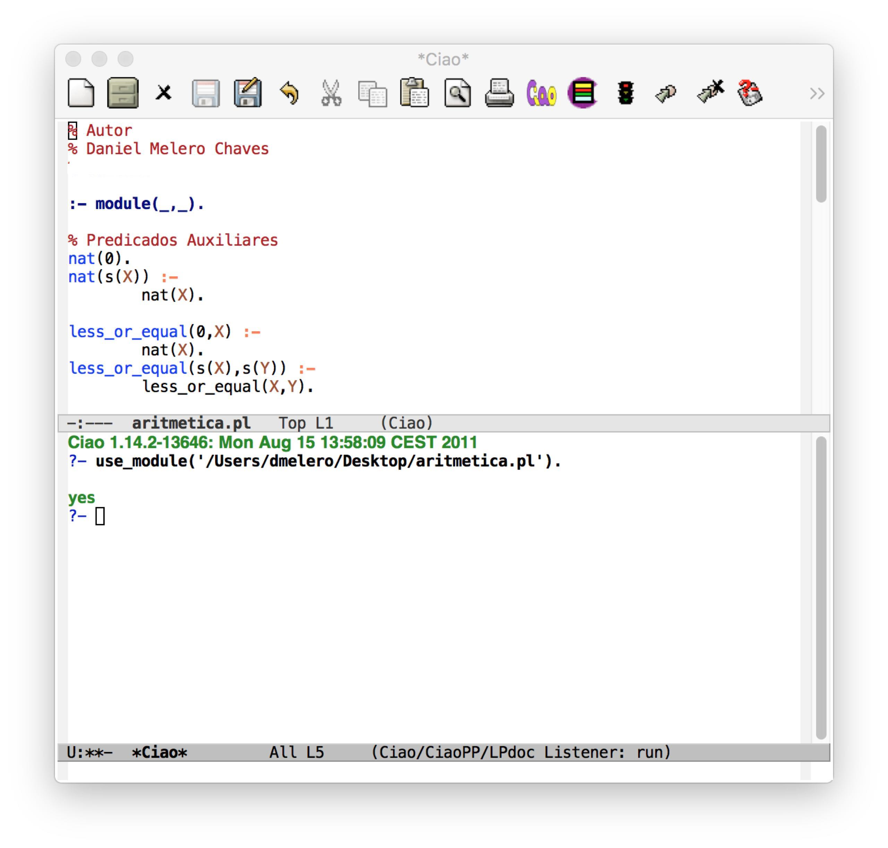

# [ES] Instalación de Ciao Prolog para MacOS

[](README_EN.md)
[](README_ES.md)

**Autores:** [Daniel Melero Chaves] (https://github.com/DanielMChaves) y [Carlos Saito Murata] (https://github.com/exacs)

1. Descargar la app de emacs

  Descargamos la app de emacs para macOS desde la página web oficial: https://emacsformacosx.com

2. Instalador del interprete en terminal

  Descargamos el interprete desde la página web oficial del desarrollador y nos descargamos la versión para Mac OS X (Leopard, Snow Leopard, Lion) http://ciao-lang.org/download_stable.html. Aunque tengamos otra versión de macOS no pasa nada, nos descargamos esa.

  Una vez instalado, abrimos la terminal para comprobar que tenemos el interprete correctamente instalado. Ejecutamos el interprete escribiendo en terminal "ciao".

  

3. Configuración de emacs

  Para finalizar, ponemos el siguiente código en el fichero de configuración de emacs (.emacs, .emacs.d/init.el, .emacs.el o similar). Esto carga el fichero ciao-mode-init.el para que funcione Ciao prolog en emacs.

```bash
(if (file-exists-p "/usr/local/lib/ciao/ciao-mode-init.el")
    (load-file "/usr/local/lib/ciao/ciao-mode-init.el"))
```

* Esta instalación ha sido realizada en un mac con macOS Sierra.

* Ejemplo del aspecto de Ciao prolog en emacs


